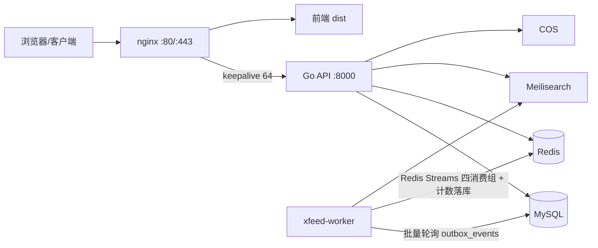

# XFeedSystem

发现型内容社区后端 API。基于 Go + Gin，自带 **Feed 打分引擎**（Redis ZSET + 每用户排名缓存）、**关注时间线**（Redis Timeline 混合 Fanout）、全文搜索（Meilisearch）与**事件驱动架构**（事务性 Outbox + Redis Streams + 独立 worker 进程），支持笔记（富文本/视频）、关注/点赞/评论/收藏、通知、拉黑、Feed 不感兴趣、站内信、举报与管理员后台，前端为 React SPA（`xfeed-discover-page-source`）。

## 技术栈

| 层 | 技术 |
|---|---|
| API | Go 1.24 · Gin · GORM（PrepareStmt 预编译） |
| 存储 | MySQL 8（Docker）· Redis 7（Docker） |
| 事件 | 事务性 Outbox（MySQL）· Redis Streams（feed/search/notify/counter 四消费组） |
| 搜索 | Meilisearch（Docker） |
| 部署 | nginx（TLS/反代/keepalive）· systemd · Docker Compose |
| 文件 | 腾讯云 COS |

## 架构



## 核心设计：事件驱动（Outbox + Redis Streams）

写请求在 API 进程完成业务写入，所有“副作用”（Feed 打分、Following Fanout、搜索索引、通知、互动计数）由独立 worker 进程异步消费事件完成：

- **事务性 Outbox**：业务写入与事件在同一个 MySQL 事务里提交（`outbox_events` 表）；点赞/收藏/评论/关注/笔记增删改都会同事务写一条事件，不丢事件。入队只 INSERT 一次，EventID 由 Relay 领取时注入。
- **Relay**：worker 周期领取待发布事件（`SKIP LOCKED` 防止多实例互抢），按批 Pipeline `XADD` 到 Redis Streams 后**批量标记已发布**；发布失败整批累加重试次数（`attempts`）。批量与间隔走 `config.yaml` 的 `event.relay` 配置（默认 500 条/100ms）。
- **消费组**：`xfeed:feed` / `xfeed:search` / `xfeed:notify` / `xfeed:counter` 四个消费组各自独立推进游标、互不拖累；批量 `XReadGroup`（默认 64 条）+ 批量 `XAck`，失败消息不 ack、留在 pending 由 `XAutoClaim` 恢复。
- **职责划分**：
  - feed 组：维护打分 ZSET、失效页缓存、驱动 Following Fanout；
  - search 组：回读 MySQL（真相源）同步 Meilisearch；
  - notify 组：整批去重创建站内通知与 @提及，未读数走 Redis Pipeline；
  - counter 组：把点赞/收藏/一级评论事件**聚合后 INCRBY** 进 Redis 计数键，再由独立 Flusher 每 2s 批量 `CASE WHEN` 落库（失败回滚 Redis，不丢计数）。
- **幂等**：通知幂等 = `notifications` 表 `(event_id, user_id)` 数据库唯一约束 + `ON CONFLICT DO NOTHING` 批量插入；计数幂等 = `cntdedup:{event_id}`（`SET NX`，24h），消费前先去重再聚合。
- **配置化与监控**：relay/consumer/counter 参数集中在 `config.yaml` 的 `event` 段；worker 每 10s 打点 outbox 积压与各消费组 `XPENDING`。
- **多实例安全**：计数器落库与打分周期重算收归 worker，API 多实例不会重复执行。

## 核心设计：Feed 引擎（foryou）

`foryou` feed 采用 **全局基础分 ZSET（候选 Top 1000）+ 每用户排名缓存 + 读时个性化 + MMR 多样性**：

- 全部已发布笔记在共享 ZSET（`feed:engine:v1:0`）中维护基础分；读取时只取全局 Top 1000 作为候选（`FeedCandidateLimit`），控制下游画像/元数据查询规模。
- 基础分（`internal/service/feed_scorer.go`）：互动量（点赞×3 + 收藏×5 + 评论×4）× 时间衰减（24h 冻结）× 关注加权 × 类型偏好 + 新笔记保底热度（48h 内线性衰减，零互动也能进首页）+ CTR 加成（阅读/曝光）。
- 分数折叠：`zsetScore = round(score×10000)×10⁶ + id`，ZSET 内无同分并列，`ZREVRANGEBYSCORE` 一条命令读候选。
- **每用户排名缓存**：个性化重排 + MMR 多样性后的最终顺序以“排名”写入 `feed:user:{id}:rank`（10s TTL），翻页命中时直接按位置切片返回，跳过全量 ZSET / 画像 / 排序；互动事件只更新单条分数、不再全局失效页缓存（避免失效风暴），隐藏/拉黑/关注变化才精确失效该用户。
- 读时个性化：按当前用户的关注关系、关注话题与类型偏好重算每条笔记分数后排序，再做「不感兴趣」过滤与拉黑过滤；这些参数（关注话题、类型偏好、隐藏集合、拉黑集合等）均带 Redis 缓存并随写操作同步维护，拉黑过滤改为“作者去重后一次 IN 批量查询”。
- 多样性（MMR）：对排序后的候选做贪心重排（O(N log N)）——已选作者的其余候选、与已选内容同话题/同类型的候选按惩罚系数衰减分数（自己的笔记不限量），替代原先“每作者最多 2 条”的硬截断。
- 位置分页：多样性重排后按**位置偏移游标**分页，顺序稳定、不重不漏。
- 不感兴趣：隐藏的笔记直接过滤出流；每次隐藏使该笔记类型的个性化权重降低 0.4（最低 -0.8，即乘数最低 0.2），连续对同一类型不感兴趣会显著下调该类型的展示权重，可随时撤销。
- 事件驱动维护：feed worker 消费事件后增量 `ZADD` 重算单条分数、`ZREM` 移除已删笔记，再失效页字节缓存；ZSET 懒重建（TTL 60s）与每 5 分钟对账兜底（比对 ZSET 与 DB 已发布数，漂移超限自动删除重建）。
- 多级缓存：首页/翻页/详情/主页响应以**原始字节**缓存于 Redis（TTL 10-60s），命中时零序列化直接返回；单条笔记另有 `feed:note:{id}` JSON 缓存（10min），Like/评论等操作直接读缓存笔记。

> 候选截断 1000 + 每用户排名缓存面向当前规模；笔记量级再上一个台阶后，可把排名缓存改成增量维护的排序结构。

## 核心设计：关注时间线（Following Feed）

`following` feed 采用 **Redis Timeline 混合 Fanout**：普通作者发布时写扩散，大 V（粉丝数 ≥ 10,000）发布时只写作者时间线、读端拉取合并。HTTP 请求不等待 fanout，全部由 feed 消费组事件驱动：

- **写路径**（`internal/service/following_fanout_service.go`）：
  - 发布笔记：先写作者时间线 `feed:author:{aid}`（必写，Celebrity Pull 数据源）；粉丝 < 10,000 再按 500 人/批 Pipeline 写进每个粉丝的 `feed:following:{uid}`；
  - 关注：回填该作者最近 100 条，关注后立刻能看到近期内容；取关：尽力清理该作者内容；
  - 删除笔记：只同步删作者时间线，粉丝侧 Timeline 保留 stale ID，读时按 published 状态与关注关系校验 + 惰性清理。
- **读路径**（`internal/service/following_feed_service.go`）：用户 Timeline + 各大 V 作者 Timeline 做 **K 路归并**（大顶堆按 (published_at, noteID) 倒序）→ 去重 → follow/block 读时过滤 → 批量水合 → 键集游标分页；Redis 未命中/异常时降级 MySQL 兜底，并异步物化冷启动 Timeline（带防惊群锁）。
- Timeline 只存 `noteID + published_at 毫秒`，正文始终以 MySQL 为准；每个 Timeline 保留最近 800 条（ZADD + Trim 同一条 Pipeline）。
- 与 foryou 的关系：foryou 是“先生成候选再排序”，following 是“先物化时间线再合并读取”，两条管线相互独立。

## 核心功能

| 功能 | 说明 |
|---|---|
| 笔记 | 富文本（白名单清洗）/ 视频 / 多图；正文首图自动作为封面；编辑自动留档，作者可查看/恢复最近 50 个版本 |
| 关注 Feed | 关注的人时间线：Redis Timeline 混合 Fanout（写扩散 + 大 V 拉取），游标分页 |
| 互动 | 点赞、收藏、评论、关注、拉黑（计数异步聚合落库） |
| 话题 | 正文 `#话题` 自动提取，热度榜/搜索；可关注话题，关注话题的内容在 Feed 中加权 ×1.5 |
| 搜索 | Meilisearch 全文搜索（标题/内容/作者）+ 用户按用户名前缀搜索 |
| 通知 | 点赞/评论/回复/关注/@提及站内通知（批量去重创建），未读数、已读管理 |
| Feed 不感兴趣 | 隐藏单条笔记，按类型降低个性化权重，支持撤销 |
| 站内信 | 发信（幂等键防重）、会话列表、与单用户聊天、未读数、已读、双向软删 |
| 举报 | 笔记/评论/用户/私信举报（内容快照 + 每日限额），管理员队列处置 |
| 管理后台 | 用户列表/封禁/删除、笔记与评论删除、举报处理、系统统计 |

## 目录结构

```
cmd/api/           # API 入口
cmd/worker/        # worker 进程（outbox relay + 四消费组 + counter 落库/flusher）
configs/           # config.yaml + 数据库初始化
internal/
  cache/           # Redis 封装（字节缓存、Feed ZSET/排名、Following Timeline、计数）
  events/          # 事件契约（类型与 Payload）
  handler/         # Gin handlers（含原始字节缓存逻辑）
  middleware/      # JWT、管理员鉴权、慢请求/错误日志
  model/           # GORM 模型
  outbox/          # 事务性 Outbox（事件写入 + relay）
  pkg/cursor/      # 游标编解码（分数游标 / 时间游标）
  queue/           # Redis Streams 消费组（单条/批量消费）
  repo/            # 数据访问层
  routers/         # 路由注册 + pprof 开关
  service/         # 业务逻辑（Feed 引擎、关注 Fanout/时间线、通知批量、站内信、举报等）
deploy/            # systemd 单元、安装脚本
migrations/        # SQL 迁移
scripts/           # Docker Compose（MySQL/Redis）
```

## 快速开始

### 依赖

- Go 1.24+（`go.mod` 要求）
- Docker（用于 MySQL/Redis/Meilisearch）

### 启动依赖

```bash
make docker-up        # 启动 MySQL(3308) + Redis(6380) 容器
docker run -d --name feed_meilisearch -p 7700:7700 \
  -e MEILI_MASTER_KEY=your_master_key getmeili/meilisearch:v1.14
```

### 配置

复制 `.env.example` 为 `.env`，按需覆盖 `config.yaml` 中的敏感项（生产必须覆盖 `XFEED_JWT_SECRET`、`XFEED_MEILISEARCH_API_KEY`、COS 密钥）：

```bash
cp .env.example .env
```

`config.yaml` 的 `event` 段集中了事件管道参数（relay 批量/间隔、consumer 批量/块读、counter 刷库间隔/批量），均有默认值；请求访问日志可通过 `XFEED_REQUEST_LOG=0` 关闭。

### 运行

```bash
make run        # 本地直接运行（go run）
make build      # 编译到 build/xfeed-api
go run ./cmd/worker   # 事件 worker（outbox relay + 四消费组）
```

## 部署

```bash
make deploy SERVER=user@host
```

`make deploy` 会打包二进制 + 配置 + 迁移 + systemd 单元，上传后在服务器执行 `deploy/install.sh update` 并自动重启服务。

> 事件 worker 需要单独部署运行：目前 `make deploy` 尚未打包 worker，可先手动编译 `go build -o build/xfeed-worker ./cmd/worker` 并配置 systemd 单元。

生产服务器组件：

| 组件 | 说明 |
|---|---|
| `xfeed-api.service` | systemd 托管 Go 服务，`/opt/xfeed/xfeed-api` |
| `xfeed-worker` | 事件 worker（outbox relay + 四消费组 + 计数落库），需单独部署 |
| nginx | TLS 终止、`/api/` 反代到 :8000（upstream keepalive 64）、HTTP→HTTPS 301、HSTS/安全头 |
| Docker | `feed_mysql`（3308→3306）、`feed_redis`（6380→6379）、`feed_meilisearch`（7700） |

## API 概览

公开接口：

| 方法 | 路径 | 说明 |
|---|---|---|
| POST | `/register` `/login` | 注册 / 登录（返回 JWT） |
| GET | `/feed?type=foryou\|following&cursor=&limit=` | Feed（引擎排序 / 关注时间线，游标分页） |
| GET | `/notes/:id` | 笔记详情（匿名走字节缓存） |
| GET | `/topics/hot` `/topics/:id/feed` `/topics/suggest` | 话题 |
| GET | `/users/:id` `/users/:id/notes` | 用户主页 / 用户笔记 |
| GET | `/users/:id/following` `/users/:id/followers` | 关注 / 粉丝列表 |
| GET | `/search?q=` | 全文搜索（Meilisearch） |
| GET | `/health/live` `/health/ready` | 健康检查 |

登录接口（JWT）：

| 方法 | 路径 | 说明 |
|---|---|---|
| GET | `/me` `/me/favorites` `/me/notifications*` | 个人中心 / 收藏 / 通知 |
| GET | `/users/search?username=` | 按用户名前缀搜索用户 |
| POST/DELETE | `/feed/hide` `/feed/hide/:noteId` | 不感兴趣（隐藏笔记）/ 撤销 |
| POST/DELETE | `/topics/:id/follow` | 关注 / 取关话题 |
| GET | `/me/topics` | 我关注的话题列表 |
| POST/PATCH/DELETE | `/notes` `/notes/:id` `/notes/:id/like` `/favorite` `/comments` | 发布 / 删除 / 点赞 / 收藏 / 评论 |
| GET | `/notes/:id/versions` `/notes/:id/versions/:vid` | 笔记版本列表 / 版本详情（仅作者） |
| POST | `/notes/:id/restore/:vid` | 恢复指定版本（仅作者） |
| POST/DELETE | `/users/:id/follow` `/users/:id/block` | 关注 / 拉黑 |
| POST | `/upload/image` `/upload/video` | 图片 / 视频上传（COS） |
| POST | `/messages` | 发送站内信（`client_message_id` 幂等） |
| GET | `/conversations` | 会话列表（游标分页） |
| GET | `/messages?peer_id=` | 与指定用户的聊天记录 |
| PATCH | `/messages/read` | 标记与某人会话已读 |
| GET | `/messages/unread-count` | 未读消息总数 |
| DELETE | `/messages/:id` | 删除单条消息（软删） |
| POST | `/reports` | 举报笔记/评论/用户/私信 |

管理接口（管理员）：

| 方法 | 路径 | 说明 |
|---|---|---|
| GET | `/admin/users` | 用户列表 |
| PATCH | `/admin/users/:id/ban` | 封禁 / 解封 |
| DELETE | `/admin/notes/:id` `/admin/comments/:id` | 删除笔记 / 评论 |
| GET | `/admin/stats` | 系统统计 |
| GET | `/admin/reports?status=` | 举报队列（0=待处理） |
| PATCH | `/admin/reports/:id` | 处置举报（成立→删除/封禁，驳回→标记） |

## 性能基线

最新实测（2026-09，8 vCPU / 15G，nginx → xfeed-api×2 + xfeed-worker，v7.1），详见 `docs/` 下各轮压测报告：

| 指标 | 数值 |
|---|---|
| 混合场景（80/20，13 接口，20-1000 并发） | ~4.5-4.8K QPS 平台，全程 0% 错误（100c p99 183ms / 500c p99 766ms） |
| 热点点赞 / 热点评论（单笔记） | ~2.3-2.9K QPS，0% 错误 |
| 事件管道（评论洪峰 ~2,750/s） | Relay 批量发布 >5,000/s，outbox 积压洪峰期内排空，四消费组 pending ~0 |
| 一致性 | `comment_count == 评论行数`，计数零丢失（最终一致，正常零延迟） |

关键优化：事件管道批量化（relay XADD / consumer XAck / notify INSERT / counter INCRBY 全走 Pipeline）、事件参数配置化、XPENDING 积压监控、GORM PrepareStmt、MySQL/Redis 连接池、Feed 字节缓存与每用户排名缓存、nginx keepalive/gzip。

## 运维

### 日志

生产环境只记录慢请求（>500ms）和错误（status>=400），见 `internal/middleware/logger.go`；压测时可用 `XFEED_REQUEST_LOG=0` 关闭访问日志。

```bash
journalctl -u xfeed-api -f
```

### pprof

压测/排障时可临时开启（用完必须关闭）：

```bash
echo 'ENABLE_PPROF=1' | sudo tee -a /opt/xfeed/.env
sudo systemctl restart xfeed-api
curl -s -o /tmp/cpu.pprof 'http://127.0.0.1:8000/debug/pprof/profile?seconds=30'
go tool pprof -http=:8081 /tmp/cpu.pprof
```

### 缓存与引擎

- 打分 ZSET：`feed:engine:v1:0`（候选 Top 1000），每用户排名缓存 `feed:user:{id}:rank`（10s TTL）；由 feed worker 增量维护，懒重建 TTL 60s + 每 5 分钟对账兜底。
- 事件流：Redis Streams `xfeed:events`，消费组 `xfeed:feed` / `xfeed:search` / `xfeed:notify` / `xfeed:counter`；通知幂等依赖 `notifications (event_id, user_id)` 唯一约束；计数键 `counter:like|favorite|comment:{noteID}`，去重键 `cntdedup:{eventID}`。
- 关注 Timeline：`feed:following:{uid}` / `feed:author:{aid}`（毫秒时间戳 ZSET，各保留最近 800 条）。
- 响应字节缓存 key：`feed:foryou:raw:*`、`feed:page:raw:*`、`note:detail:raw:*`、`user:profile:raw:*`；单条笔记 JSON `feed:note:{id}`；未读数 `notif:unread:{uid}`。

## 已知限制

- 互动计数改为异步聚合落库（Redis → 每 2s 批量刷库）：正常延迟一个刷库周期，评论洪峰时随事件管道积压而拉长，但不丢计数。
- `following` 关注时间线：Redis 冷启动首请求走 MySQL SQL 分页兜底，并异步物化 Timeline；Redis 恢复后自动切回。
- 登录用户详情接口（含 is_liked/is_favorited）不走字节缓存。
- Feed 候选 Top 1000 + 每用户排名缓存面向当前规模设计，规模增大后需要替换为增量维护的排序结构。
- `make deploy` 暂未打包 worker 与对应 systemd 单元，需要手动部署。
- 事件发布失败仅靠轮询重试（`attempts` 计数），暂无死信队列与告警。
