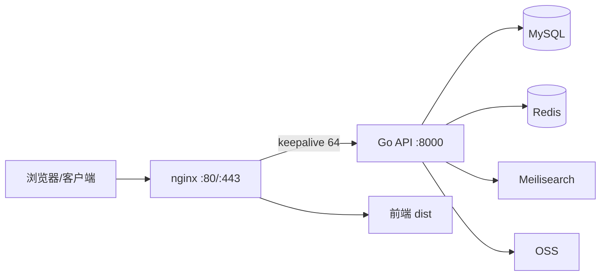

# XFeedSystem

发现型内容社区后端 API。基于 Go + Gin，自带 **Feed 打分引擎**（Redis ZSET）、全文搜索（Meilisearch）、关注/点赞/评论/收藏、通知与管理员后台，前端为 React SPA（`xfeed-discover-page-source`）。

## 技术栈

| 层 | 技术 |
|---|---|
| API | Go 1.24 · Gin · GORM |
| 存储 | MySQL 8（Docker）· Redis 7（Docker） |
| 搜索 | Meilisearch（Docker） |
| 部署 | nginx（TLS/反代/keepalive）· systemd · Docker Compose |
| 文件 | 阿里云 OSS |

## 架构



## 核心设计：Feed 引擎

`foryou` feed 采用 **Redis ZSET 预计算打分 + 游标分页**：

- 全部已发布笔记参与打分，无候选池上限，任意深度都可翻到。
- 打分公式（`internal/service/feed_scorer.go`）：互动量（点赞×3 + 收藏×5 + 评论×4）× 时间衰减 × 关注加权 × 类型偏好。
- 分数折叠：`zsetScore = round(score×10000)×10⁶ + id`，ZSET 内无同分并列，分页用 `ZREVRANGEBYSCORE key "(cursor"` 一条命令完成，O(log n)。
- 匿名用户共享全局 ZSET（`feed:engine:v1:0`），登录用户按关注/类型偏好构建个人 ZSET。
- 懒重建：TTL 60s，重建时每用户 singleflight 防惊群。
- 多级缓存：首页/翻页/详情/主页响应以**原始字节**缓存于 Redis（TTL 10-60s），命中时零序列化直接返回。

## 目录结构

```
cmd/api/           # 入口
configs/           # config.yaml + 数据库初始化
internal/
  cache/           # Redis 封装（JSON/字节缓存、Feed 引擎 ZSET）
  handler/         # Gin handlers（含原始字节缓存逻辑）
  middleware/      # JWT、慢请求/错误日志
  model/           # GORM 模型
  pkg/cursor/      # 游标编解码（分数游标 / 时间游标）
  repo/            # 数据访问层
  routers/         # 路由注册 + pprof 开关
  service/         # 业务逻辑（Feed 引擎、打分）
deploy/            # systemd 单元、安装脚本
migrations/        # SQL 迁移
scripts/           # Docker Compose（MySQL/Redis）
```

## 快速开始

### 依赖

- Go 1.24+（`go.mod` 要求）
- Docker（用于 MySQL/Redis/Meilisearch）

### 启动依赖

```bash
make docker-up        # 启动 MySQL(3308) + Redis(6380) 容器
docker run -d --name feed_meilisearch -p 7700:7700 \
  -e MEILI_MASTER_KEY=your_master_key getmeili/meilisearch:v1.14
```

### 配置

复制 `.env.example` 为 `.env`，按需覆盖 `config.yaml` 中的敏感项（生产必须覆盖 `XFEED_JWT_SECRET`、`XFEED_MEILISEARCH_API_KEY`、OSS 密钥）：

```bash
cp .env.example .env
```

### 运行

```bash
make run        # 本地直接运行（go run）
make build      # 编译到 build/xfeed-api
```

## 部署

```bash
make deploy SERVER=user@host
```

`make deploy` 会打包二进制 + 配置 + 迁移 + systemd 单元，上传后在服务器执行 `deploy/install.sh update` 并自动重启服务。

生产服务器组件：

| 组件 | 说明 |
|---|---|
| `xfeed-api.service` | systemd 托管 Go 服务，`/opt/xfeed/xfeed-api` |
| nginx | TLS 终止、`/api/` 反代到 :8000（upstream keepalive 64）、HTTP→HTTPS 301、HSTS/安全头 |
| Docker | `feed_mysql`（3308→3306）、`feed_redis`（6380→6379）、`feed_meilisearch`（7700） |

## API 概览

| 方法 | 路径 | 说明 |
|---|---|---|
| POST | `/register` `/login` | 注册 / 登录（返回 JWT） |
| GET | `/feed?type=foryou\|following&cursor=&limit=` | Feed（引擎排序 / 关注流，游标分页） |
| GET | `/notes/:id` | 笔记详情（匿名走字节缓存） |
| GET | `/users/:id` `/users/:id/notes` | 用户主页 / 用户笔记 |
| GET | `/search?q=` | 全文搜索（Meilisearch） |
| GET | `/health/live` `/health/ready` | 健康检查 |
| POST | `/notes` `/notes/:id/like` `/notes/:id/comments` | 发布 / 点赞 / 评论（需登录） |
| GET | `/me` `/me/favorites` `/me/notifications` | 个人中心（需登录） |
| GET | `/admin/*` | 管理后台（管理员） |

## 性能基线（2C2G 实测）

| 指标 | 数值 |
|---|---|
| 混合场景（75% 缓存 / 15% 翻页 / 5% 详情 / 5% 主页） | ~970 QPS，p50 < 60ms |
| 首页 / 翻页（字节缓存命中，直连） | ~3600-3700 QPS |
| 详情 / 主页（字节缓存命中，直连） | ~2500-2800 QPS |
| 空接口 /ping | ~6300 QPS |
| 错误率 | 目标略超容量时 ~5%（客户端超时），服务端零 500 |

关键优化：连接池配置、MySQL `max_connections`、nginx worker_connections/keepalive/gzip、Feed 引擎 ZSET、响应字节缓存、慢请求日志。

## 运维

### 日志

生产环境只记录慢请求（>500ms）和错误（status>=400），见 `internal/middleware/logger.go`。

```bash
journalctl -u xfeed-api -f
```

### pprof

压测/排障时可临时开启（用完必须关闭）：

```bash
echo 'ENABLE_PPROF=1' | sudo tee -a /opt/xfeed/.env
sudo systemctl restart xfeed-api
curl -s -o /tmp/cpu.pprof 'http://127.0.0.1:8000/debug/pprof/profile?seconds=30'
go tool pprof -http=:8081 /tmp/cpu.pprof
```

### 缓存与引擎

- 打分 ZSET：`feed:engine:v1:{userID}`，TTL 60s 自动重建；点赞/评论/新笔记最长 60s 后反映（可后续在写操作中主动删除 key 立即刷新）。
- 响应字节缓存 key：`feed:foryou:raw:*`、`feed:page:raw:*`、`note:detail:raw:*`、`user:profile:raw:*`。

## 已知限制

- `following` 关注流暂用 SQL 分页，未接入打分引擎。
- 登录用户详情接口（含 is_liked/is_favorited）不走字节缓存。
- 写操作（点赞/评论/发笔记）暂不主动失效引擎与页缓存，依赖 TTL 自愈。
