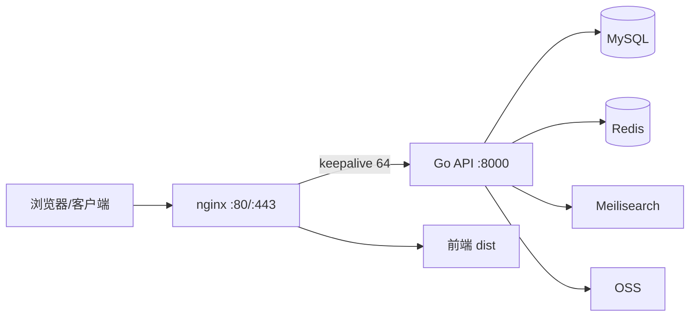

# XFeedSystem

发现型内容社区后端 API。基于 Go + Gin，自带 **Feed 打分引擎**（Redis ZSET）、全文搜索（Meilisearch），支持笔记（富文本/视频）、关注/点赞/评论/收藏、通知、拉黑、Feed 不感兴趣、站内信、举报与管理员后台，前端为 React SPA（`xfeed-discover-page-source`）。

## 技术栈

| 层 | 技术 |
|---|---|
| API | Go 1.24 · Gin · GORM |
| 存储 | MySQL 8（Docker）· Redis 7（Docker） |
| 搜索 | Meilisearch（Docker） |
| 部署 | nginx（TLS/反代/keepalive）· systemd · Docker Compose |
| 文件 | 阿里云 OSS |

## 架构



## 核心设计：Feed 引擎

`foryou` feed 采用 **全局基础分 ZSET + 读时个性化 + 位置偏移分页**：

- 全部已发布笔记在共享 ZSET（`feed:engine:v1:0`）中维护基础分，无候选池上限。
- 基础分（`internal/service/feed_scorer.go`）：互动量（点赞×3 + 收藏×5 + 评论×4）× 时间衰减（24h 冻结）× 关注加权 × 类型偏好 + 新笔记保底热度（48h 内线性衰减，零互动也能进首页）+ CTR 加成（阅读/曝光）。
- 分数折叠：`zsetScore = round(score×10000)×10⁶ + id`，ZSET 内无同分并列，`ZREVRANGEBYSCORE` 一条命令读全量候选。
- 读时个性化：按当前用户的关注关系与类型偏好重算每条笔记分数后排序，再依次做「不感兴趣」过滤、拉黑过滤、作者去重（每作者最多 2 条、自己不限量），最后按**位置偏移游标**分页——个性化排序与基础分顺序不一致时也不会漏内容。
- 不感兴趣：隐藏的笔记直接过滤出流；每次隐藏使该笔记类型的个性化权重降低 0.4（最低 -0.8，即乘数最低 0.2），连续对同一类型不感兴趣会显著下调该类型的展示权重，可随时撤销。
- 懒重建：TTL 60s，重建时 singleflight 防惊群；每 5 分钟后台重算热门笔记。
- 写操作同步维护：发布笔记 `ZADD` 单条、删除笔记 `ZREM` 即时移除；点赞/收藏/评论等会主动失效引擎与页缓存，TTL 兜底。
- 多级缓存：首页/翻页/详情/主页响应以**原始字节**缓存于 Redis（TTL 10-60s），命中时零序列化直接返回。

> 当前全量候选 + 排序面向百级笔记规模；笔记量级再上一个台阶后，可改为增量维护的排序结构。

## 核心功能

| 功能 | 说明 |
|---|---|
| 笔记 | 富文本（白名单清洗）/ 视频 / 多图；正文首图自动作为封面；编辑自动留档，作者可查看/恢复最近 50 个版本 |
| 互动 | 点赞、收藏、评论、关注、拉黑 |
| 搜索 | Meilisearch 全文搜索（标题/内容/作者）+ 用户按用户名前缀搜索 |
| 通知 | 点赞/评论/回复/关注/@提及站内通知，未读数、已读管理 |
| Feed 不感兴趣 | 隐藏单条笔记，按类型降低个性化权重，支持撤销 |
| 站内信 | 发信（幂等键防重）、会话列表、与单用户聊天、未读数、已读、双向软删 |
| 举报 | 笔记/评论/用户/私信举报（内容快照 + 每日限额），管理员队列处置 |
| 管理后台 | 用户列表/封禁/删除、笔记与评论删除、举报处理、系统统计 |

## 目录结构

```
cmd/api/           # 入口
configs/           # config.yaml + 数据库初始化
internal/
  cache/           # Redis 封装（JSON/字节缓存、Feed 引擎 ZSET）
  handler/         # Gin handlers（含原始字节缓存逻辑）
  middleware/      # JWT、管理员鉴权、慢请求/错误日志
  model/           # GORM 模型
  pkg/cursor/      # 游标编解码（分数游标 / 时间游标）
  repo/            # 数据访问层
  routers/         # 路由注册 + pprof 开关
  service/         # 业务逻辑（Feed 引擎、打分、站内信、举报等）
deploy/            # systemd 单元、安装脚本
migrations/        # SQL 迁移
scripts/           # Docker Compose（MySQL/Redis）
```

## 快速开始

### 依赖

- Go 1.24+（`go.mod` 要求）
- Docker（用于 MySQL/Redis/Meilisearch）

### 启动依赖

```bash
make docker-up        # 启动 MySQL(3308) + Redis(6380) 容器
docker run -d --name feed_meilisearch -p 7700:7700 \
  -e MEILI_MASTER_KEY=your_master_key getmeili/meilisearch:v1.14
```

### 配置

复制 `.env.example` 为 `.env`，按需覆盖 `config.yaml` 中的敏感项（生产必须覆盖 `XFEED_JWT_SECRET`、`XFEED_MEILISEARCH_API_KEY`、OSS 密钥）：

```bash
cp .env.example .env
```

### 运行

```bash
make run        # 本地直接运行（go run）
make build      # 编译到 build/xfeed-api
```

## 部署

```bash
make deploy SERVER=user@host
```

`make deploy` 会打包二进制 + 配置 + 迁移 + systemd 单元，上传后在服务器执行 `deploy/install.sh update` 并自动重启服务。

生产服务器组件：

| 组件 | 说明 |
|---|---|
| `xfeed-api.service` | systemd 托管 Go 服务，`/opt/xfeed/xfeed-api` |
| nginx | TLS 终止、`/api/` 反代到 :8000（upstream keepalive 64）、HTTP→HTTPS 301、HSTS/安全头 |
| Docker | `feed_mysql`（3308→3306）、`feed_redis`（6380→6379）、`feed_meilisearch`（7700） |

## API 概览

公开接口：

| 方法 | 路径 | 说明 |
|---|---|---|
| POST | `/register` `/login` | 注册 / 登录（返回 JWT） |
| GET | `/feed?type=foryou\|following&cursor=&limit=` | Feed（引擎排序 / 关注流，游标分页） |
| GET | `/notes/:id` | 笔记详情（匿名走字节缓存） |
| GET | `/topics/hot` `/topics/:id/feed` `/topics/suggest` | 话题 |
| GET | `/users/:id` `/users/:id/notes` | 用户主页 / 用户笔记 |
| GET | `/users/:id/following` `/users/:id/followers` | 关注 / 粉丝列表 |
| GET | `/search?q=` | 全文搜索（Meilisearch） |
| GET | `/health/live` `/health/ready` | 健康检查 |

登录接口（JWT）：

| 方法 | 路径 | 说明 |
|---|---|---|
| GET | `/me` `/me/favorites` `/me/notifications*` | 个人中心 / 收藏 / 通知 |
| GET | `/users/search?username=` | 按用户名前缀搜索用户 |
| POST/DELETE | `/feed/hide` `/feed/hide/:noteId` | 不感兴趣（隐藏笔记）/ 撤销 |
| POST/PATCH/DELETE | `/notes` `/notes/:id` `/notes/:id/like` `/favorite` `/comments` | 发布 / 删除 / 点赞 / 收藏 / 评论 |
| GET | `/notes/:id/versions` `/notes/:id/versions/:vid` | 笔记版本列表 / 版本详情（仅作者） |
| POST | `/notes/:id/restore/:vid` | 恢复指定版本（仅作者） |
| POST/DELETE | `/users/:id/follow` `/users/:id/block` | 关注 / 拉黑 |
| POST | `/upload/image` `/upload/video` | 图片 / 视频上传（OSS） |
| POST | `/messages` | 发送站内信（`client_message_id` 幂等） |
| GET | `/conversations` | 会话列表（游标分页） |
| GET | `/messages?peer_id=` | 与指定用户的聊天记录 |
| PATCH | `/messages/read` | 标记与某人会话已读 |
| GET | `/messages/unread-count` | 未读消息总数 |
| DELETE | `/messages/:id` | 删除单条消息（软删） |
| POST | `/reports` | 举报笔记/评论/用户/私信 |

管理接口（管理员）：

| 方法 | 路径 | 说明 |
|---|---|---|
| GET | `/admin/users` | 用户列表 |
| PATCH | `/admin/users/:id/ban` | 封禁 / 解封 |
| DELETE | `/admin/notes/:id` `/admin/comments/:id` | 删除笔记 / 评论 |
| GET | `/admin/stats` | 系统统计 |
| GET | `/admin/reports?status=` | 举报队列（0=待处理） |
| PATCH | `/admin/reports/:id` | 处置举报（成立→删除/封禁，驳回→标记） |

## 性能基线（2C2G 实测）

| 指标 | 数值 |
|---|---|
| 混合场景（75% 缓存 / 15% 翻页 / 5% 详情 / 5% 主页） | ~970 QPS，p50 < 60ms |
| 首页 / 翻页（字节缓存命中，直连） | ~3600-3700 QPS |
| 详情 / 主页（字节缓存命中，直连） | ~2500-2800 QPS |
| 空接口 /ping | ~6300 QPS |
| 错误率 | 目标略超容量时 ~5%（客户端超时），服务端零 500 |

关键优化：连接池配置、MySQL `max_connections`、nginx worker_connections/keepalive/gzip、Feed 引擎 ZSET、响应字节缓存、慢请求日志。

## 运维

### 日志

生产环境只记录慢请求（>500ms）和错误（status>=400），见 `internal/middleware/logger.go`。

```bash
journalctl -u xfeed-api -f
```

### pprof

压测/排障时可临时开启（用完必须关闭）：

```bash
echo 'ENABLE_PPROF=1' | sudo tee -a /opt/xfeed/.env
sudo systemctl restart xfeed-api
curl -s -o /tmp/cpu.pprof 'http://127.0.0.1:8000/debug/pprof/profile?seconds=30'
go tool pprof -http=:8081 /tmp/cpu.pprof
```

### 缓存与引擎

- 打分 ZSET：`feed:engine:v1:0`，TTL 60s 自动重建；发布/删除笔记即时 `ZADD`/`ZREM`，点赞/评论/收藏等写操作主动失效引擎与页缓存。
- 响应字节缓存 key：`feed:foryou:raw:*`、`feed:page:raw:*`、`note:detail:raw:*`、`user:profile:raw:*`。

## 已知限制

- `following` 关注流暂用 SQL 分页，未接入打分引擎。
- 登录用户详情接口（含 is_liked/is_favorited）不走字节缓存。
- Feed 全量候选排序针对当前百级笔记规模设计，规模增大后需要替换为增量排序结构。
